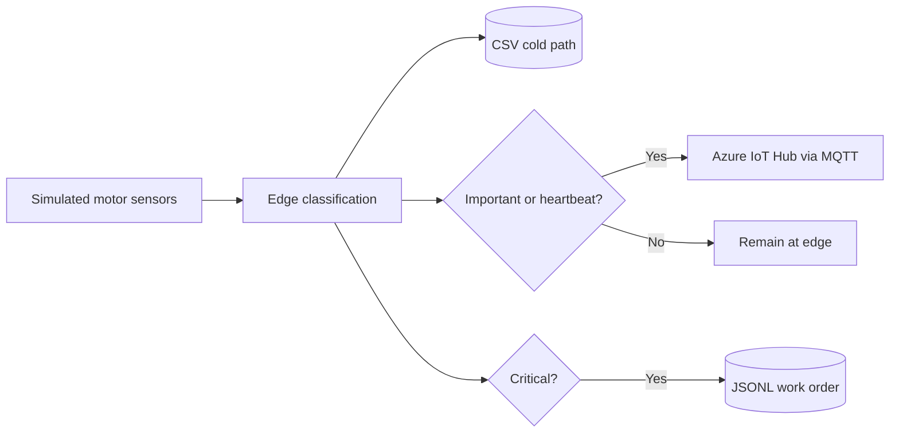

# Enterprise IoT Lab — Motor Telemetry Simulator

This lab demonstrates a simple **enterprise IoT pipeline** using Node.js and Azure IoT Hub. It simulates a motor sensor, classifies readings locally, saves them to a file, sends selected readings to the cloud, and creates maintenance events for critical readings.

## What this project teaches

This project shows how to:

- simulate an IoT device without physical hardware;
- classify sensor data close to the device (**edge processing**);
- separate a **cold path** from a **hot path**;
- publish JSON telemetry to Azure IoT Hub over MQTT;
- attach application properties to an IoT message;
- turn a critical sensor reading into a maintenance event; and
- protect a device connection string with an environment variable.

## The big picture



A reading can have three destinations:

| Destination | When it receives data | Purpose |
|---|---|---|
| `telemetry-cold-path.csv` | Every reading | Complete history for later analysis or auditing |
| Azure IoT Hub | Warning/critical readings, plus every fifth heartbeat | Fast cloud visibility without sending every normal reading |
| `work-orders.jsonl` | Critical readings only | Simulated maintenance-system integration |

The CSV and JSONL outputs are ignored by Git because they are generated runtime data.

## Core ideas in simple language

### Edge computing

The simulator classifies each reading locally before it sends anything to Azure. In a real factory, this reduces bandwidth, cloud cost, and response time because the device or gateway can decide what matters immediately.

### Hot path and cold path

- **Hot path:** data that needs prompt attention. This project sends abnormal readings and periodic heartbeats to Azure IoT Hub.
- **Cold path:** data retained for later use. This project writes every reading to a CSV file.

### Telemetry versus an enterprise event

Telemetry describes what the device observed, such as temperature or vibration. A work-order event describes the action required. Converting a critical reading to `MAINTENANCE_WORK_ORDER_REQUESTED` connects the simulated motor to a maintenance system.

## How one reading travels through the program

1. `readSensors()` creates temperature, humidity, and vibration values.
2. Every seventh reading is deliberately abnormal so the critical route can be tested.
3. `classify()` assigns `normal`, `warning`, or `critical`.
4. `saveColdPath()` appends the reading to the CSV file.
5. `sendTelemetry()` sends non-normal readings and every fifth reading to Azure as a heartbeat.
6. `createWorkOrder()` appends a maintenance event when the status is critical.
7. After 20 readings, the timer stops and the Azure client closes.

With the current settings, the simulator generates a reading every 3 seconds and stops after 20 readings. Every seventh reading is critical, while every fifth reading acts as a heartbeat.

## Classification rules

The `classify()` function checks rules in severity order:

| Status | Rule |
|---|---|
| `critical` | temperature ≥ 60 °C **or** vibration ≥ 8 mm/s |
| `warning` | temperature ≥ 50 °C **or** vibration ≥ 6 mm/s |
| `normal` | neither rule above is true |

Either high temperature or high vibration is enough to raise the status.

The current generator produces normal and critical readings. The warning rule is present for future sensor ranges, but the generated values do not currently enter that range.

## Project files

```text
enterprise-iot-lab/
├── .env                         # Private Azure device connection string
├── .gitignore                   # Excludes secrets, dependencies, and generated data
├── package.json                 # Node.js metadata and dependencies
├── simulator.js                 # Entire simulation and routing logic
├── telemetry-cold-path.csv      # Generated full telemetry history
└── work-orders.jsonl            # Generated maintenance events
```

Important packages:

- `azure-iot-device` — Azure device client and message types;
- `azure-iot-device-mqtt` — MQTT transport used by the client; and
- `dotenv` — loads values from `.env` into `process.env`.

## Setup

### Prerequisites

- Node.js and npm;
- an Azure IoT Hub;
- a registered IoT Hub device; and
- that device's **device connection string**.

Use the registered device's connection string, not an IoT Hub service connection string.

### 1. Install dependencies

```bash
npm install
```

### 2. Configure the device credential

Create a `.env` file in the project root:

```dotenv
IOTHUB_DEVICE_CONNECTION_STRING="HostName=<hub>.azure-devices.net;DeviceId=<device>;SharedAccessKey=<key>"
```

Never commit `.env` or paste its real value into screenshots, reports, or chat messages. The repository's `.gitignore` already excludes it.

### 3. Run the simulator

```bash
node simulator.js
```

Console messages:

- `Connected to Azure IoT Hub` — authentication and MQTT connection succeeded;
- `EDGE ONLY:` — a normal reading was stored but not sent;
- `CLOUD:` — a reading was sent to IoT Hub;
- `ERP EVENT:` — a critical reading created a maintenance request;
- `Finished...` — all 20 readings were processed and the client closed.

## Understanding the output

### Cold-path CSV

`telemetry-cold-path.csv` contains one header row followed by one row per reading:

```csv
deviceId,sequence,timestamp,temperatureC,humidityPct,vibrationMmS,status
motor-sensor-01,1,2026-08-16T07:32:12.141Z,39.63,57.2,4.71,normal
```

This file can be opened in a spreadsheet for analysis or charting.

### Work-order JSONL

`work-orders.jsonl` stores one complete JSON object per line:

```json
{"type":"MAINTENANCE_WORK_ORDER_REQUESTED","assetId":"motor-sensor-01","priority":"HIGH","reason":"Critical telemetry: 64.25 C, 10.12 mm/s","createdAt":"2026-08-16T07:32:30.189Z","sourceSequence":7}
```

JSONL stores one JSON object per line, so events can be appended easily. `sourceSequence` identifies the reading that caused the event.

### Azure message

The message body contains the complete reading as JSON. It also has these application properties:

| Property | Example | Why it helps |
|---|---|---|
| `status` | `critical` | Cloud routes can filter by severity without parsing the body |
| `source` | `edge-simulator` | Identifies where the message originated |

The content metadata declares `application/json` with UTF-8 encoding.

## Code map

| Function/constant | Responsibility |
|---|---|
| `randomBetween(min, max)` | Produces a two-decimal simulated value |
| `readSensors()` | Builds one timestamped sensor reading |
| `classify(reading)` | Applies the safety thresholds |
| `saveColdPath(reading)` | Creates/appends the CSV history |
| `sendTelemetry(reading)` | Builds and publishes an Azure IoT message |
| `createWorkOrder(reading)` | Writes a business-level maintenance event |
| `run()` | Connects the client and coordinates the complete lifecycle |
| `SEND_INTERVAL_MS` | Controls time between readings (currently 3000 ms) |
| `MAX_READINGS` | Controls when the demonstration ends (currently 20) |

## Cloud routing condition

```js
const heartbeat = reading.sequence % 5 === 0;
if (reading.status !== 'normal' || heartbeat) {
  await sendTelemetry(reading);
}
```

`sequence % 5 === 0` is true for readings 5, 10, 15, and 20. Azure therefore receives:

- any warning or critical reading, because it is not normal; **or**
- every fifth reading, even if it is normal, to prove the device is alive.

This edge filtering reduces cloud traffic while still sending urgent readings and regular device health signals.

## Troubleshooting

| Symptom | Likely cause | What to check |
|---|---|---|
| `Missing IOTHUB_DEVICE_CONNECTION_STRING` | `.env` is absent or the key is misspelled | File location and exact variable name |
| Startup/authentication error | Invalid connection string or disabled device | IoT Hub device identity and copied device credential |
| Connection timeout | Network or MQTT traffic is blocked | Internet connection, firewall, and IoT Hub availability |
| No CSV header | An old/empty file already existed | Remove the generated CSV before a clean run |
| No warning readings | Simulator ranges skip the warning band | This is expected with the current generator |
| Duplicate sequence numbers across runs | `sequence` starts at zero each process | Treat each run as a separate session or add a run ID |

## Limitations

This is a teaching example rather than a production system:

- file writes are synchronous and block the Node.js event loop briefly;
- CSV values are built manually rather than escaped by a CSV library;
- `setInterval()` can start another callback before a slow cloud send completes;
- failed sends are logged but are not retried or queued;
- device ID and thresholds are hard-coded;
- generated files grow by appending across runs; and
- the JSONL file simulates a maintenance integration instead of calling a real API.

A production version would need features such as validation, retry logic, durable message storage, log rotation, monitoring, and graceful shutdown handling.

## Study exercises

Try these in increasing difficulty:

1. Change `MAX_READINGS` to 10 and predict which readings reach Azure.
2. Change the abnormal frequency from every seventh to every fourth reading.
3. Modify the random ranges so some readings become `warning` without becoming `critical`.
4. Move thresholds and device ID into `.env` variables.
5. Add a `runId` so readings from multiple executions can be distinguished.
6. Replace `setInterval()` with a loop that waits after each completed send, preventing overlap.
7. Add retry logic for transient Azure failures.
8. Route IoT Hub messages by their `status` application property.

## Quick revision

```text
readSensors()    -> creates motor data
classify()       -> assigns normal, warning, or critical
saveColdPath()   -> stores every reading in CSV
sendTelemetry()  -> sends abnormal readings and heartbeats to Azure
createWorkOrder()-> creates a JSONL event for critical readings
run()            -> coordinates the process and closes the client
```
